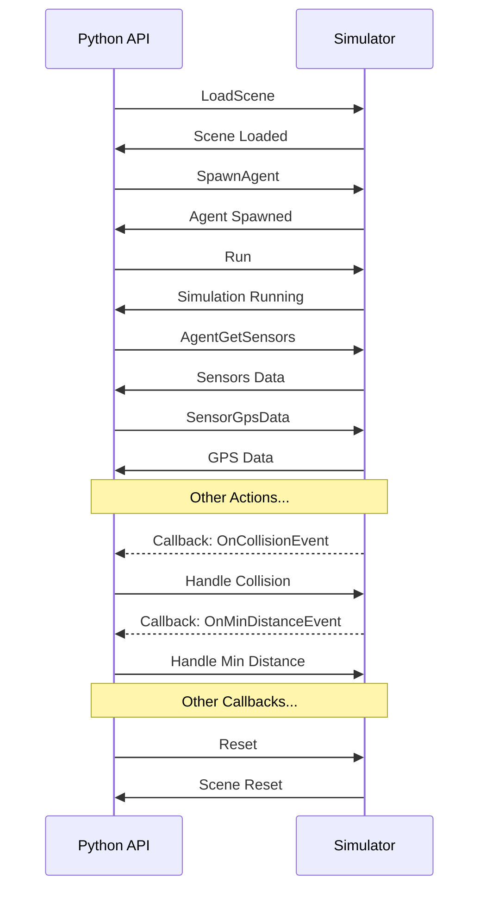

# Zilant Robotics Aerial Robots Simulator API Documentation

Welcome to the API documentation for the Zilant Robotics Aerial Robots Simulator. 
This documentation provides an in-depth understanding of how to interact with our simulator, leveraging the power of `grpc` and our dedicated `zlrsimapi`.

- **gRPC Framework**: gRPC is a high-performance, open-source, universal remote procedure call (RPC) framework. It allows for communication between applications. Our simulator uses gRPC to facilitate interactions between your applications and the simulator. More about gRPC can be found [here](https://grpc.io/).

- **zlrsimapi**: This is the core API library for the Zilant Robotics Aerial Robots Simulator. Generated by the protocol buffer compiler, it offers a structured way to interact with the simulator. Detailed content about `zlrsimapi` can be accessed in the [API folder](../API/).

## Table of Contents

- [Requirements](#requirements)
- [Quickstart](#quickstart)
- [Core Concepts](#core-concepts)
- [Basics](#basics)
  - [Basic Data Types](#basic-data-types)
  - [Sensors Data Types](#sensors-data-types)
  - [Enumerations](#enumerations)
- [Primary Services](#primary-services)
- [Available APIs Details](#available-apis-details)
  - [1. Scene Management](#1-scene-management)
    - LoadScene
    - Reset
    - GetCurrentScene
  - [2. Agent Management](#2-agent-management)
    - SpawnAgent
    - GetSpawn
  - [3. Obstacle Management](#3-obstacle-management)
    - SpawnObstacle
  - [4. Simulator Control](#4-simulator-control)
    - Run
  - [5. Event Subscriptions & Queries](#5-event-subscriptions--queries)
    - [5.1 Collision Detection](#51-collision-detection)
    - [5.2 Distance Monitoring](#52-distance-monitoring)
    - [5.3 Bounding Box Query](#53-bounding-box-query)
  - [6. Agent Management & Sensor Interactions](#6-agent-management--sensor-interactions)
    - [6.1 Removing Agents](#61-removing-agents)
    - [6.2 Sensor Queries & State Manipulation](#62-sensor-queries--state-manipulation)
    - [6.3 GPS Data & Coordinate Translations](#63-gps-data--coordinate-translations)
  - [7. Landing Platform Interactions](#7-landing-platform-interactions)
  - [8. Failures Simulation](#8-simulation-failures)
  - [9. Environment Interactions](#9-environment-interactions)
    - [9.1 Raycasting in Simulation](#91-raycasting-in-simulation)
    - [9.2 Weather and Time Control](#92-weather-and-time-control)


## Requirements

Before getting started with the Zilant Robotics Aerial Robots Simulator, ensure you have the following requirements set up:

1. **gRPC Framework**: Ensure gRPC is installed and set up for your development environment. Follow the instructions [here](https://grpc.io/) to install and configure gRPC.

2. **Zilant Robotics Simulator API Library (zlrsimapi)**: This library is essential for interacting with the Zilant Robotics Aerial Robots Simulator. Clone or download the library and ensure it's accessible in your development environment. The main components are found in the [API folder](API/).

  ```bash
  cd API
  python3 -m pip install .
  ```

3. **Python Environment**: Most of our examples are written in Python. Ensure you have Python 3.7 or later installed.

## Quickstart

1. **Load a Scene**: Begin by loading a specific simulation scene, like the 'MainScene'.

   ```python
   stub.LoadScene(api_pb2.LoadSceneRequest(scene = 'MainScene'))
   ```

   Refer to [01-SpawnAgent-LoadScene-Reset-Run-GetSpawn.py](../API/examples/01-SpawnAgent-LoadScene-Reset-Run-GetSpawn.py) for a complete example.

2. **Spawn an Agent**: Introduce an agent into the simulation environment.

   ```python
   AgentUid = stub.SpawnAgent(api_pb2.SpawnAgentRequest(...))
   ```

3. **Run the Simulation**: Initiate the simulator.

   ```python
   stub.Run(api_pb2.RunRequest(timeLimit = 0))
   ```

## Core Concepts

- **Agent**: an agent represents UAV that can move or perform actions within the simulation. Each agent has a unique identifier (UID) and specific transformation properties denoting its position and orientation in the virtual space.

- **Sensor**: Devices that can collect and transmit data about the environment. Include video sensors (cameras), Lidar sensors, etc. Agents can have one or multiple sensors attached.

- **Scene**: Refers to the simulation environment where agents operate. Different scenes might represent different geographical locations or challenges.

- **Transform & State**: These data types provide information on the positioning (Transform) and motion (State) of objects within the simulator. This includes position, rotation, velocity, and angular velocity.

## Basics

Note: The actual state and specific formats are detailed in the api.proto file within the repository. It's recommended to refer to this file for the most up-to-date and detailed specifications.

### Basic Data Types:

1. **Vector3**: Represents a 3D vector.
    - **x**: Float (X component)
    - **y**: Float (Y component)
    - **z**: Float (Z component)

2. **Transform**: Represents an object's position and rotation in 3D space.
    - **position**: Vector3 (3D Position)
    - **rotation**: Vector3 (3D Rotation)

3. **State**: Represents an object's state in 3D space.
    - **transform**: Transform (Object's transform)
    - **velocity**: Vector3 (3D Velocity)
    - **angularVelocity**: Vector3 (3D Angular Velocity)

4. **BoundingBox**: Represents a 3D bounding box.
    - **min**: Vector3 (Minimum bounds)
    - **max**: Vector3 (Maximum bounds)

5. **Agent**: Contains information about an agent.
    - **uid**: String (Unique ID of the agent)
    - **transform**: Transform (Agent's position and rotation)

6. **CommonSensorProperties**: Contains properties that are common across different sensors.
    - **id**: String (Unique ID)
    - **name**: String (Name of the sensor)
    - **publishRate**: Float (Publish rate in Hz)

7. **Gps**: Represents GPS data.
    - **northing**, **easting**: Double (Coordinates)
    - **latitude**, **longitude**, **altitude**: Double (Geographic location)
    - **orientation**: Double (Direction the GPS is facing)

### Sensors Data Types:

#### VideoSensor:

- **common**: Every sensor has a common set of properties that include the unique id, name, and publish rate. This is extracted into a nested message for reusability.

- **width** and **height**: These fields indicate the resolution of the video sensor.

- **fieldOfView**: Measures the observable world that is seen at any given moment. In cameras, this translates to how zoomed in or out the view appears.

- **nearClipPlane** and **farClipPane**: Define the distances where objects will start and stop being rendered in the camera's view. Anything outside these planes will not be displayed.

- **Type**: An enumeration to differentiate between the types of video data the sensor captures.

- **intrinsics_matrix**: Contains the camera's intrinsic parameters which define its internal characteristics. It's important for camera calibration and 3D reconstruction.

- **distortion**: Parameters to correct any distortion in the captured image. 

- **format**: Specifies the format in which the video data is represented (e.g., RGB, grayscale, etc.)

- **linkedVideoSensorUID**: If the video sensor is linked to another, its UID is mentioned here.

#### LidarSensor:

- **common**: Standard properties shared across sensors.

- **minDistance** and **maxDistance**: Define the operational range of the Lidar.

- **rayCount**: The number of individual lasers the Lidar uses to capture data.

- **measurementsPerRotation**: Specifies how many measurements the Lidar captures in one rotation.

- **fieldOfView**: Similar to the video sensor, it represents the observable area.

- **centerAngle**: Indicates the center angle of the Lidar's view.

- **compensated**: A boolean to indicate if the Lidar sensor compensates for certain factors like vehicle movement.

#### GPSSensor and IMUSensor:

- **common**: Both these sensors contain only the standard set of properties (not used at a moment).

### Enumerations:

1. **VideoSensor.Type**: Represents the type of video sensor.
    - **RGB**
    - **DEPTH**
    - **SEMANTIC**
    - **INFRARED**

2. **SpawnAgentRequest.Type**:
    - **UNKNOWN**
    - **AGENT**

3. **SpawnObstacleRequest.Type**:
    - **UNKNOWN**
    - **NPC**
    - **OBSTACLE**

4. **LandingPlatformControlRequest.State**:
    - **CLOSE**
    - **OPEN**

5. **EmitFailureRequest.FailureType**:
    - **ENGINE**
    - **PROPELLER**
    - **ACCUMULATOR**

6. **SpawnAgentRequest.Type**:
    - **UNKNOWN**
    - **AGENT**
   
7. **SpawnObstacleRequest.Type**:
    - **UNKNOWN**
    - **NPC**
    - **OBSTACLE**

8. **LandingPlatformControlRequest.State**:
    - **CLOSE**
    - **OPEN**

## Primary Services


### Scene Management
1. **LoadScene**: Load a specific simulation scene.
2. **GetCurrentScene**: Fetch the current active scene's identification or name.

### Agent Management (Control)
3. **SpawnAgent**: Spawn a specific agent type within the simulation.
4. **AgentOnCollision**: Subscribe to notifications when a specified agent collides.
5. **AgentOnMinDistance**: Subscribe to alerts when an agent approaches a minimum distance from another object.
6. **RemoveAgent**: Remove a specific agent from the simulation.

### Obstacle Management
7. **SpawnObstacle**: Create obstacles or NPCs (non-player characters) in the simulation.

### Simulator Control
8. **GetSpawn**: Retrieve spawn points within the scene.
9. **MapFromGps**: Convert GPS coordinates to scene/world coordinates.
10. **MapToGps**: Transform scene/world coordinates to their GPS counterparts.
11. **Reset**: Reset the simulation or environment to its default state.
12. **Raycast**: Conduct a raycast in the simulation environment.
13. **Run**: Initiate the simulation to run for a specified time duration.

### Environment Control
14. **TimeOfDaySet**: Set a specified time within the simulation.
15. **TimeOfDayGet**: Get the current simulated time of day.
16. **WeatherSet**: Modify the weather conditions in the simulation.
17. **WeatherGet**: Fetch existing weather conditions.

### Event Subscriptions & Queries
18. **SubscribeOnCollisionEvent**: Subscribe to collision events.
19. **SubscribeOnMinDistanceEvent**: Subscribe to minimum distance events.
20. **UnsubscribeAll**: Unsubscribe from all events.
21. **AgentGetBBox**: Retrieve the bounding box of a given agent.

### Sensor Interactions
22. **AgentGetSensors**: Fetch all sensors attached to a given agent.
23. **SensorGetTransform**: Get the position and rotation of a sensor.
24. **SensorSetState**: Enable or disable a sensor.
25. **SensorGetState**: Get the current state (enabled/disabled) of a sensor.
26. **SensorGpsData**: Gather GPS data from a GPS sensor.

### Landing Platform Interactions
27. **LandingPlatformControl**: Manage the landing platform's state.

### Emit Failures
28. **EmitFailure**: Introduce a specific type of failure to a device.


Diagram illustrating API execution:



## Available APIs Details

### 1. **Scene Management**

Managing the simulated environment's scene.

- **LoadScene**: Transition between various scenes available in the simulator, e.g., the 'MainScene'. [Example: 01-SpawnAgent-LoadScene-Reset-Run-GetSpawn.py](../API/examples/01-SpawnAgent-LoadScene-Reset-Run-GetSpawn.py)

  ```python
  stub.LoadScene(api_pb2.LoadSceneRequest(scene = 'MainScene'))
  ```

  Scenes available:
  -  MainScene
  -  ConstructionScene

- **Reset**: Reinitialize the scene without changing it. Handy when wanting to restart a simulation scenario. [Example](../API/examples/01-SpawnAgent-LoadScene-Reset-Run-GetSpawn.py)

  ```python
  stub.Reset(api_pb2.ResetRequest())
  ```

- **GetCurrentScene**: Fetch the current active scene. Useful for conditional logic based on the scene. [Example](../API/examples/01-SpawnAgent-LoadScene-Reset-Run-GetSpawn.py)

### 2. **Agent Management**

Interactions related to various agents in the simulation.

- **SpawnAgent**: Introduce agents into the simulation, specifying their initial conditions. [Example: 01-SpawnAgent-LoadScene-Reset-Run-GetSpawn.py](../API/examples/01-SpawnAgent-LoadScene-Reset-Run-GetSpawn.py)

  ```python
  AgentUid = stub.SpawnAgent(api_pb2.SpawnAgentRequest(...))
  ```

  Agents available:
  - Octocopter-Amazon
  - Vtol-Seeker
  - Octocopter-Amazon01
  - Vtol-T300
  - Quadcopter-M690
  - Vtol-TFM15

- **GetSpawn**: Obtain a list of available spawn points within the scene. [Example](../API/examples/01-SpawnAgent-LoadScene-Reset-Run-GetSpawn.py)

### 3. **Obstacle Management**

Introduce and manage obstacles in the simulation.

- **SpawnObstacle**: Spawn various obstacles, from helicopters to cars, to challenge the simulation scenarios. [Example: 02-SpawnObstacle.py](../API/examples/02-SpawnObstacle.py)

  ```python
  SpawnObstacleResponse = stub.SpawnObstacle(SpawnObstacleRequest)
  ```

  Obstacles names available:
  - M300;
  - Helicopter
  - MiniCountryman

### 4. **Simulator Control**

Control the simulator's operation directly.

- **Run**: Directly control the simulator's running state. [Example: 02-SpawnObstacle.py](../API/examples/02-SpawnObstacle.py)

  ```python
  stub.Run(api_pb2.RunRequest(timeLimit = 0))
  ```

## 5. **Event Subscriptions & Queries**

### 5.1 Collision Detection 

Detect when an agent comes into contact with another object within the scene. 

- **AgentOnCollision**: Subscribes an agent to collision events. This will notify the user when the subscribed agent has collided with an object. [Example: 03-AgentOnCollision-SubscribeOnCollisionEvent.py](../API/examples/03-AgentOnCollision-SubscribeOnCollisionEvent.py)
    
  ```python
  stub.AgentOnCollision(api_pb2.AgentOnCollisionRequest(uid = AgentUid))
  ```

- **SubscribeOnCollisionEvent**: Listens for collision events on the subscribed agents and retrieves them as they occur.

  ```python
  iterator = stub.SubscribeOnCollisionEvent(api_pb2.CollisionEventRequest())
  while True:
      print(next(iterator))
  ```

### 5.2 Distance Monitoring 

Monitor the proximity between agents or other objects within the scene.

- **AgentOnMinDistance**: Subscribes an agent to minimum distance events, notifying the user when another object gets closer than a specified threshold. [Example: 04-AgentOnMinDistance.py](../API/examples/04-AgentOnMinDistance.py)
  
  ```python
  stub.AgentOnMinDistance(api_pb2.AgentOnMinDistanceRequest(uid = AgentUid))
  ```

- **SubscribeOnMinDistanceEvent**: Listens for minimum distance events and retrieves them for the subscribed agent.

  ```python
  iterator = stub.SubscribeOnMinDistanceEvent(api_pb2.OnMinDistanceEventRequest())
  while True:
      print(next(iterator))
  ```

### 5.3 Bounding Box Query 

Query the axis-aligned bounding box of an agent.

- **AgentGetBBox**: Retrieves the axis-aligned bounding box of the specified agent, which can be used for various collision detection or scene layout calculations. [Example: 05-AgentGetBBox.py](../API/examples/05-AgentGetBBox.py)

  ```python
  AgentGetBBoxResponse = stub.AgentGetBBox(api_pb2.AgentGetBBoxRequest(uid = AgentUid))
  print('AgentGetBBoxResponse : ', AgentGetBBoxResponse)
  ```

## 6. **Agent Management & Sensor Interactions**

### 6.1 Removing Agents 

Control when to de-spawn or remove agents from the simulation environment. 

- **RemoveAgent**: De-spawns an agent from the simulation using its unique identifier. [Example: 06-RemoveAgent.py](../API/examples/06-RemoveAgent.py)
  
  ```python
  RemoveAgentRequest = api_pb2.RemoveAgentRequest(uid = AgentUid)
  RemoveAgentResponse = stub.RemoveAgent(RemoveAgentRequest)
  ```

### 6.2 Sensor Queries & State Manipulation 

Manage and query sensor information on agents.

- **AgentGetSensors**: Retrieve all sensors available for an agent. [Example: 07-AgentGetSensors-SensorGetTransform-SensorSetState-SensorGetState.py](../API/examples/07-AgentGetSensors-SensorGetTransform-SensorSetState-SensorGetState.py)

  ```python
  AgentGetSensorsRequest = api_pb2.AgentGetSensorsRequest(uid = AgentUid)
  AgentGetSensorsResponse = stub.AgentGetSensors(AgentGetSensorsRequest)
  ```

- **SensorGetTransform**: Get the spatial transformation of a sensor. This can be useful when trying to determine the position and orientation of sensors on an agent.
  
  ```python
  sensorTf = stub.SensorGetTransform(api_pb2.SensorGetTransformRequest(uid = sensor.common.id))
  ```

- **SensorSetState & SensorGetState**: Toggle the state of sensors (on/off) and query their current status.

  ```python
  stub.SensorSetState(api_pb2.SensorSetStateRequest(uid=sensor.common.id, enabled = True))
  SensorGetStateRequest = api_pb2.SensorGetStateRequest(uid = sensor[0].common.id) 
  SensorGetStateResponse = stub.SensorGetState(SensorGetStateRequest)
  ```

### 6.3 GPS Data & Coordinate Translations 

Extract GPS data from sensors and translate between global and simulator internal coordinate systems.

- **SensorGpsData**: Retrieve GPS data from a GPS sensor. [Example: 08-SensorGpsData-MapFromGps-MapToGps.py](../API/examples/08-SensorGpsData-MapFromGps-MapToGps.py)
  
  ```python
  SensorGpsDataRequest = api_pb2.SensorGpsDataRequest(uid = sensor[0].common.id) 
  SensorGpsDataResponse = stub.SensorGpsData(SensorGpsDataRequest)
  ```

- **MapFromGps**: Convert global GPS coordinates to the simulator's internal coordinate system.
  
  ```python
  MapFromGpsResponse = stub.MapFromGps(MapFromGpsRequest)
  ```

- **MapToGps**: Convert from the simulator's internal coordinate system to global GPS coordinates.
  
  ```python
  MapToGpsRequest = api_pb2.MapToGpsRequest(transform = UnityTransform)
  MapToGpsResponse = stub.MapToGps(MapToGpsRequest)
  ```


## 7. **Landing Platform Interactions**

### 7.1 Control Landing Platforms

Manipulate landing platforms in the simulated environment to simulate different scenarios for landing operations.

- **LandingPlatformControl**: Manage the state of specific landing platforms in the simulation. [Example: 09-LandingPlatformControl.py](../API/examples/09-LandingPlatformControl.py)

  ```python
  LandingPlatformControlRequest = api_pb2.LandingPlatformControlRequest(platformIndex = 0, platformState = 1)
  LandingPlatformControlResponse = stub.LandingPlatformControl(LandingPlatformControlRequest)
  ```


## 8. **Simulation Failures**

### 8.1 Emit Failures

Simulate failures in the environment to test the robustness and resilience of agents against unexpected disruptions.

- **EmitFailure**: Trigger a simulated failure in the environment. [Example: 10-EmitFailure.py](../API/examples/10-EmitFailure.py)

  ```python
  EmitFailureRequest = api_pb2.EmitFailureRequest() 
  EmitFailureResponse = stub.EmitFailure(EmitFailureRequest)
  ```


## 9. **Environment Interactions**

### 9.1 Raycasting in Simulation

Detect objects along a straight path in the simulation, useful for object detection and measurement.

- **Raycast**: Use raycasting for object detection or hit tests within the simulated environment. [Example: 11-Raycast.py](../API/examples/11-Raycast.py)

  ```python
  RaycastRequest = api_pb2.RaycastRequest(layerMask = 961, origin = OriginFrom, direction = DirectionTo, maxDistance = 50000)
  RaycastResponse = stub.Raycast(RaycastRequest)
  ```

### 9.2 Weather and Time Control

Retrieve and manipulate environmental conditions to understand their effect on agents.

- **TimeOfDayGet**: Fetch the current time within the simulation. [Example: 12-WeatherAndTime.py](../API/examples/12-WeatherAndTime.py)

  ```python
  GetTimeResponse = stub.TimeOfDayGet(api_pb2.TimeOfDayGetRequest())
  ```

- **WeatherGet**: Obtain details about the prevailing weather conditions in the simulation.

  ```python
  GetWeatherResponse = stub.WeatherGet(api_pb2.WeatherGetRequest())
  ```
