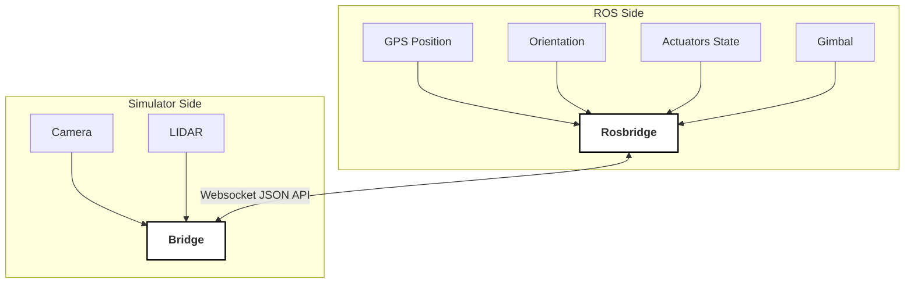

# ROS Interface with 3d Simulator

Real-time communication between ROS and the simulator is achieved through the integration of Rosbridge.
[Rosbridge](http://wiki.ros.org/rosbridge_suite) provides a JSON API to ROS functionality for non-ROS programs. 
This allows ROS topics to be used to control UAVs (changing agent pose and actuator state) and to send simulated sensor data.
Here's a detailed breakdown of the ROS topics used to interface with the simulator.

## Data Flow: ROS to Simulator

These topics are used for sending data from ROS to the simulator.

### 1. Agent GPS Position

- **Topic Name:** `/sim/gps_position`
- **Type:** `sensor_msgs/NavSatFix`

### 2. Agent Orientation

- **Topic Name:** `/sim/attitude`
- **Type:** `geometry_msgs/QuaternionStamped`

### 3. Agent Actuators State

- **Topic Name:** `/sim/actuators`
- **Type:** `sensor_msgs/Joy`

The `Joy` message's axes are assigned as follows:

1. **FR:** Front right motor speed (cw, rate, rpm)
2. **RL:** Rear left motor speed (cw, rate, rpm)
3. **FL:** Front left motor speed (ccw, rate, rpm)
4. **RR:** Rear right motor speed (ccw, rate, rpm)
5. [for VTOL] **Left Aileron:** (cw, deg)
6. [for VTOL] **Right Aileron:** (cw, deg)
7. [for VTOL] **Elevator:** (cw, deg)
8. [for VTOL] **Rudder:** (cw, deg)
9. [for VTOL] **Thrust:** Throttle (rate, rpm)

### 4. Agent Gimbal State

- **Topic Name:** `/sim/gimbal_angle`
- **Type:** `geometry_msgs/Vector3Stamped`

The values are as follows:
- `vector.x`: Roll (in degrees)
- `vector.y`: Pitch (in degrees)
- `vector.z`: Yaw (in degrees)

## Data Flow: Simulator to ROS

These topics stream simulated sensors data from the simulator to ROS.

### 1. Camera

- **Topic Name:** `/sim/camera/compressed`
- **Type:** `sensor_msgs/CompressedImage`

### 2. LIDAR

- **Topic Name:** `/sim/velodyne_points`
- **Type:** `sensor_msgs/PointCloud2`

